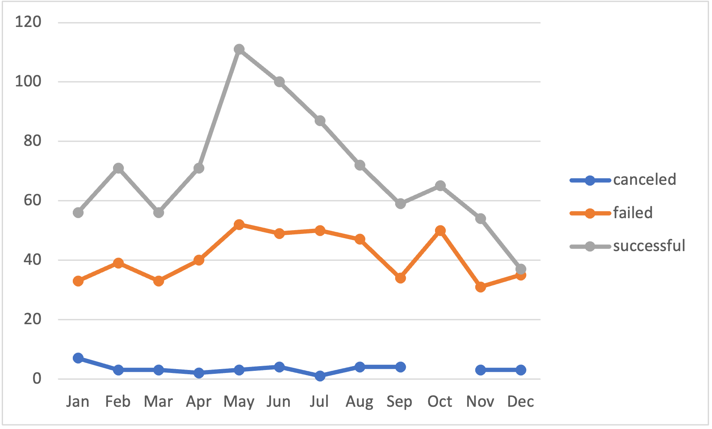
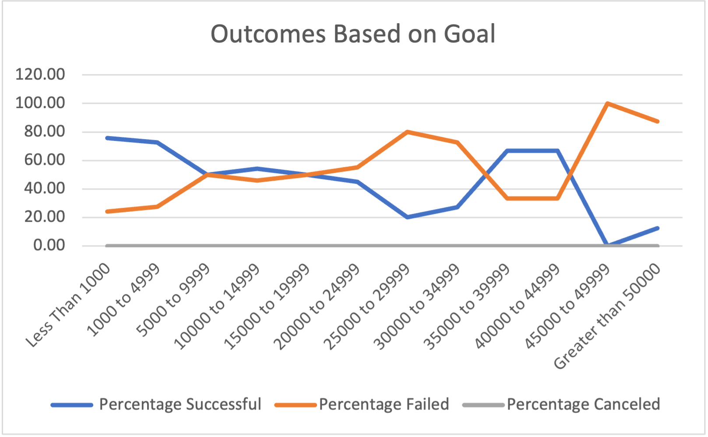

# An Analysis of Kickstarter Campaigns
Performing analysis on Kickstarter data to uncover trends. 

## Overview of Project
We will find out if there is a relationship between launch dates and funding goals and its implication to outcome fo the campaigns.

### Purpose
To visualize the campaign outcomes based on launch dates and their funding goals.

## Analysis and Challenges

### Analysis of Outcomes Based on Launch Date

	1. 	There is a trend that fundraising campaigns that were launched in late April and May had the most success
	2. But also the fundraising that started in May also had the most failed otucomes. 
	3. Because of similar trends of outcome in both failed and successful campaigns, I can suspect that there's another reason behind the outcome of campaigns besides the launch date.
### Challenges and Difficulties Encountered
	For part 1, I created a pivot table using the data. Using the Years and Parent category as filters,  I was able to bring out a graph that showed trends between the launch dates and outcome.
	I had some difficulty understanding what it is to put the outcome in a descending order because the otucome would not appear in descending order of number. But I figured out what it meant was the order of the outcome to be successful, failed and canceled. 

### Analysis of Outcomes Based on Goals

	There is an interesting trend in relationiship between fundraising goals and outcomes. When the fundraising goal was less than $1000, there was about 76% chance that the campaign was successful. As the goal amount increased there was less chance the campaign became successful. However, when the goal was relatively high between $35,000 and $44,999, the success rate was 67% which is high. But the number of projects was also small, so we can't say with confidence that all campaigns with large amounts of goal turnes out to be successful yet. 

### Challenges and Difficulties Encountered
	It was challenging for me to write countif function especially when there are two inequalities which is basically everything but the first row. However, by copying and pasting the created formula to the next cell and then editing it, I managed to pull it together. 

## Results

### What are two conclusions you can draw about the Outcomes based on Launch Date?
			1. Both success and failure of the campaign was highest in May and June. The number of theater campaigns is the highest in May and June so it is natural that it follows this trend. 
			2. There seems to be other variables such as goal amounts that influence the outcome of the campaigns because both success and failure rates increase simultaneously in Apriland May.

### What are some limitations of this dataset?
		1. For _Theater Outcomes by Launch Date_ , we don't know if the goal amounts also affected the outcome. For example, it could be that increasing success for May could be because the campaigns during May have lower or higher goal amounts. 
		2. For _Outcome Based on Goals_, we have limitations that each thresholds of goal amounts doesn't have equal number of data. 

### What are some other possible tables and/or graphs that we could create?

	We could integrate goal amounts and launch date together to see if there is a relationship between goal amounts and launch date to the outcome. 

